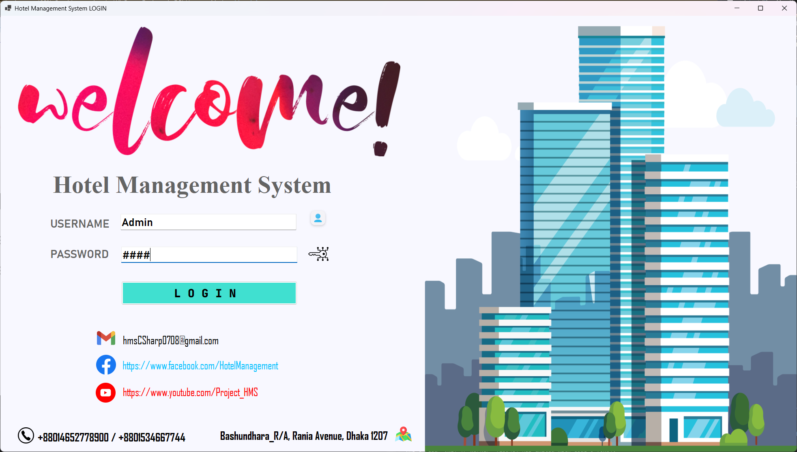
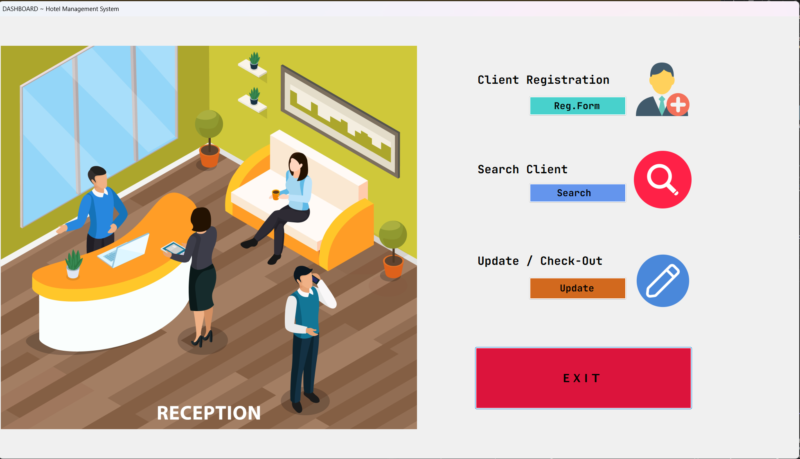
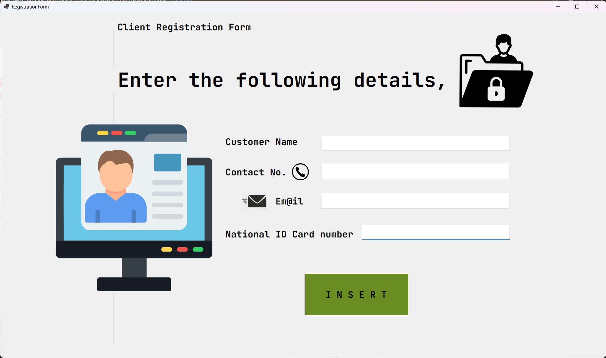
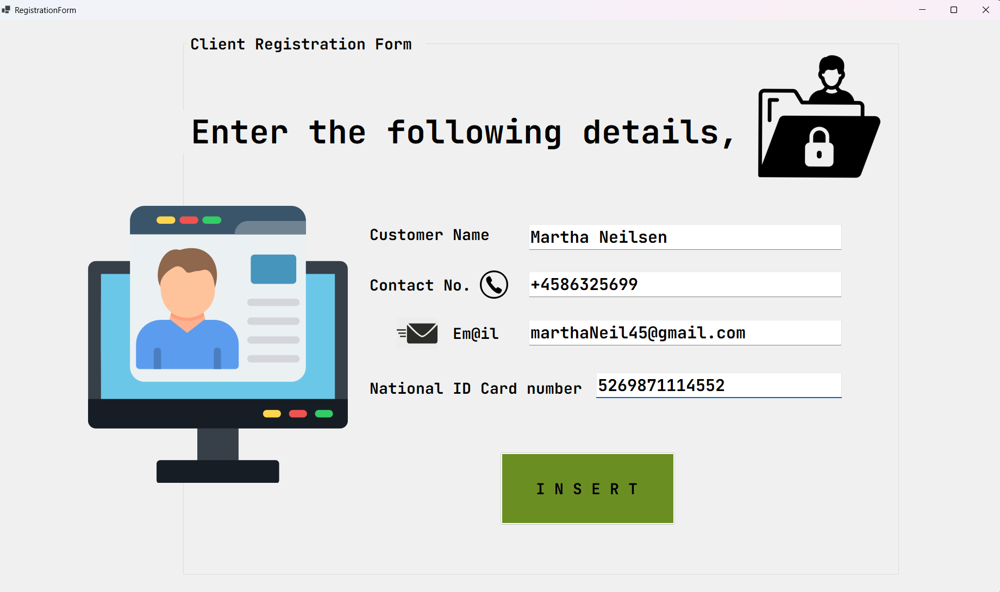
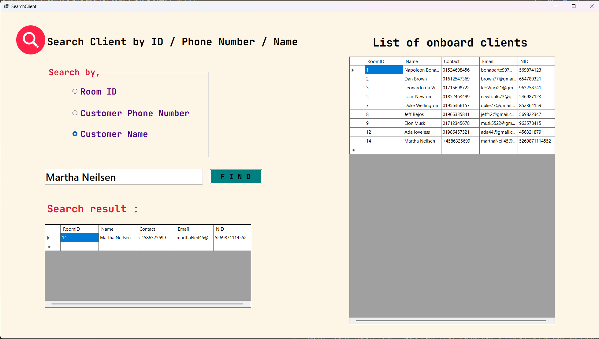
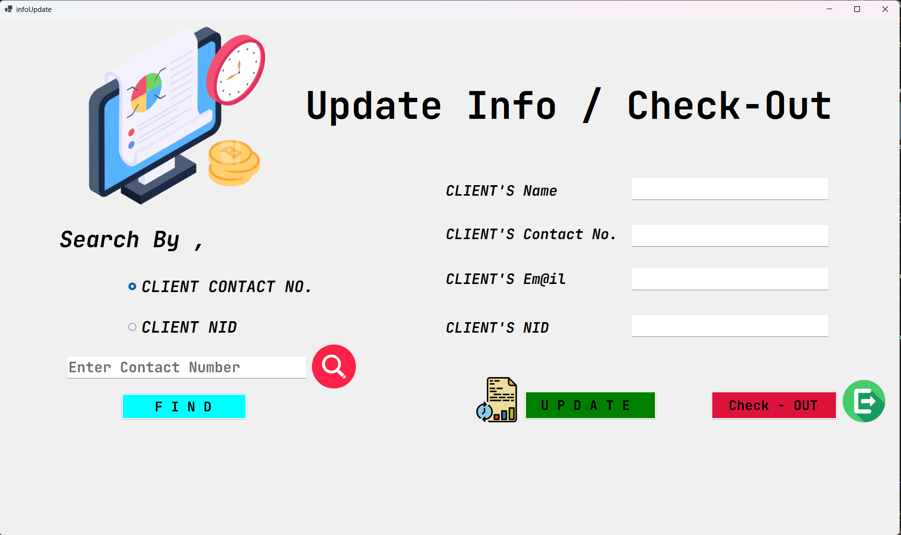
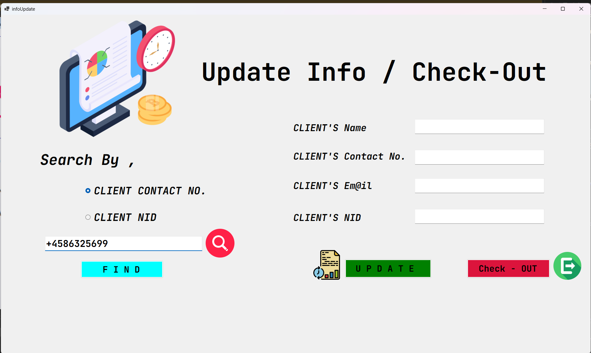
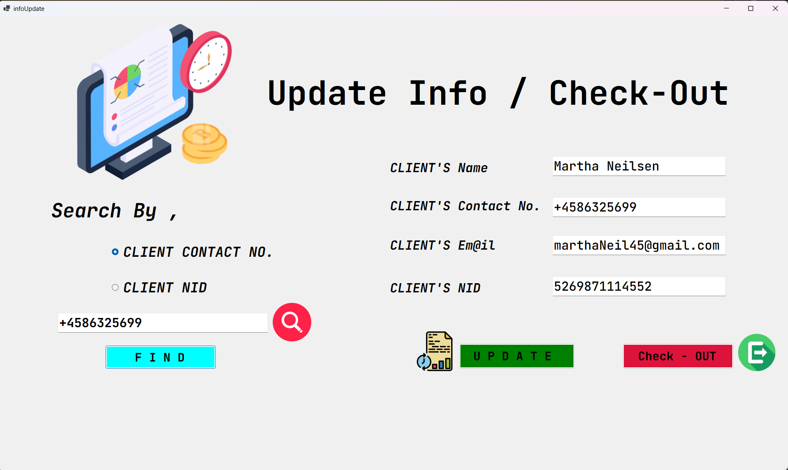
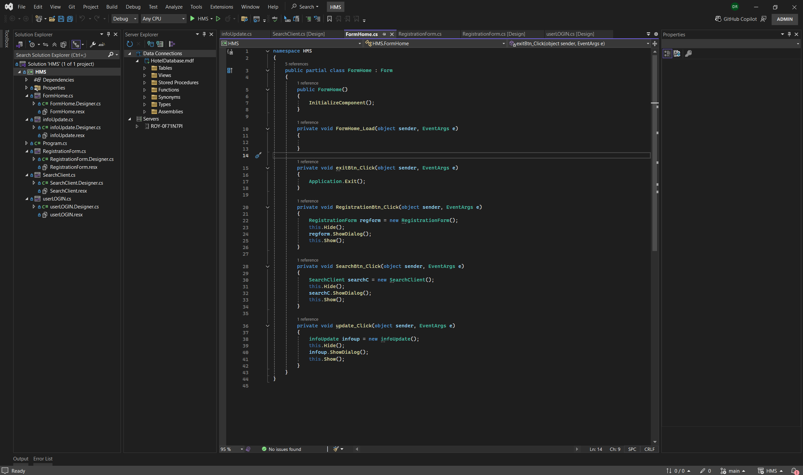

<h1 align="center">🏨 Hotel Management System (C#)</h1>

A desktop-based Hotel Management System built using <b>C#</b> and Windows Forms to manage bookings, guests, room allocation, check-in/out, and hotel operations efficiently.

---

## 📌 Project Overview

This project is a complete Hotel Management System designed to digitalize hotel operations. It helps manage guest registration, reception handling, room booking, record updates, and guest search operations through a simple GUI.

---

## ✨ Features

- 🔐 User Login System  
- 🏠 Reception Dashboard  
- 🧾 Guest Registration / Booking System  
- 🔍 Guest Search System  
- ✏️ Update Guest Records  
- 🛏️ Room Management Support  
- 💻 Clean GUI Interface  
- 🗄️ Database Integration  
- ⚡ Fast and Simple Workflow  

---

## 🛠️ Technologies Used

| Technology | Purpose |
|------------|--------|
| C# | Programming Language |
| .NET Framework | Application Development |
| Windows Forms | GUI Design |
| SQL Server / MySQL | Database |
| Visual Studio | IDE |

---

## 📂 Project Structure

HotelManagementSystem/
│
├── HMS/              → Main C# source code
├── assets/           → UI icons and component images
├── result/           → Final screenshots of system
└── README.md

## 🎨 UI Screens Overview

These images represent different modules and interfaces of the Hotel Management System.

---

### 🔐 Login System

  

---

### 🏠 Reception Dashboard

  

---

### 🧾 Guest Registration System

  

  

---

### 🔍 Guest Search System

  

---

### ✏️ Update Guest Records

  

  

  

  

---

### 💻 Code Snapshot

  

---

## 🎯 Objectives

- Digitize hotel operations  
- Reduce manual booking processes  
- Improve guest management efficiency  
- Provide fast search and update system  
- Centralized hotel database management  

---

## 🔮 Future Improvements

- Role-based login system (Admin / Manager / Receptionist)  
- Online room booking system  
- Email and SMS notifications  
- Cloud database integration  
- Advanced reporting and analytics system  

---

## 🚀 How to Run

1. Clone the repository  
git clone https://github.com/your-username/HotelManagementSystem.git

---
## 👨‍💻 Developer

**Dhrubo Chandra Roy**  
🎓 CSE Student | 💻 Software Developer | 🧠 Competitive Programmer  

- 🌐 GitHub: https://github.com/dhruboxR  
- 📧 Email: your-email@example.com  
- 📍 Location: Dhaka, Bangladesh  

---

⭐ If you like this project, don’t forget to give it a star!
